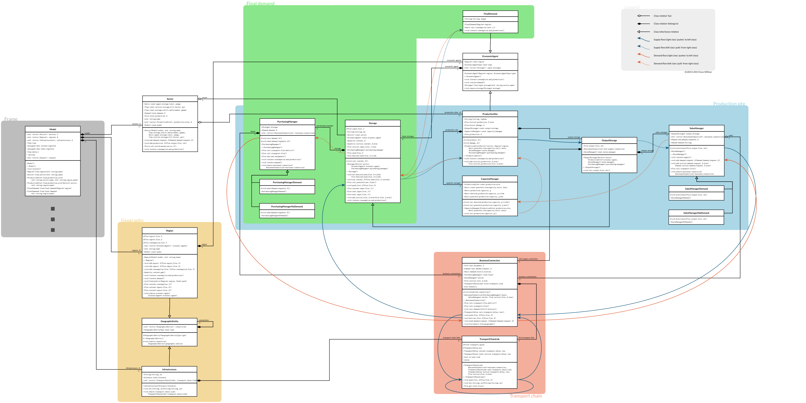

# Acclimate Model - Basic and Demand version

This is the **old** (2014) C++98 implementation of the basic and the demand version of the economic loss propagation model Acclimate. It should not be used for research anymore.

Class diagram of the model core itself (frame classes ommitted):

Basic version described in:

- Bierkandt R, Wenz L, Willner SN, Levermann A. (2014).
  **Acclimate - a model for economic damage propagation. Part I: basic
  formulation of damage transfer within a global supply network and
  damage conserving dynamics**.
  Environment Systems and Decisions, 34, 507-524.
  doi:[10.1007/s10669-014-9523-4](http://dx.doi.org/10.1007/s10669-014-9523-4).

Demand version described in:

- Wenz L, Willner SN, Bierkandt R, Levermann A. (2014).
  **Acclimate - a model for economic damage propagation. Part II: a
  dynamic formulation of the backward effects of disaster-induced
  production failures in the global supply network**.
  Environment Systems and Decisions, 34, 525-539.
  doi:[10.1007/s10669-014-9521-6](http://dx.doi.org/10.1007/s10669-014-9521-6).
